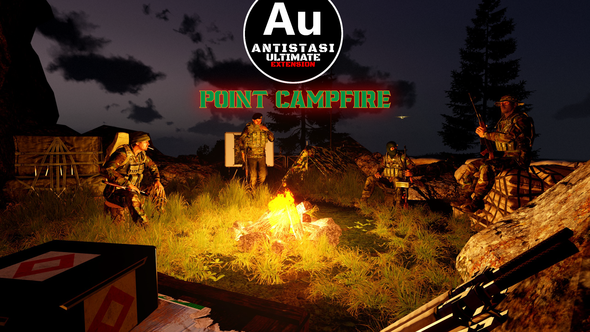

  <h1>Point Campfire</h1>
  <h3>An Antistasi Ultimate Extender</h3>
  

    <i>An Arma 3 Antistasi Ultimate Extender mod designed to suit the needs of our own friends-group   and hopefully useful for small servers with fewer than 10 players.</i>
     
  

<picture>
  
</picture>

<h2> The scope of this extension:</h2>

An AU Extension made with the **small squad / private friends-only servers such as our own in mind**. Expect a bunch of changes that may look like made to cheese the gameplay, but also know that almost all of these changes are **optional with a parameter toggle**. The aim is to provide servers with few players the opportunity to do most activities in some way, <ins>lessening the disadvantage of not having multiple people for any kind of role or activity</ins>.

Also this project has some quality of life features that we ourselves seek out, such as appending nearby town names to POI markers on the map, but may turn up unwanted due to preference or machine performance differences. We'll try to keep everything optional with a parameter toggle so you can pick features you wanna have. After all, this extender is made for private servers in mind.

Lastly, this extension heavily modifies the base Antistasi Ultimate code rather than using new files for the most part. Thus, <ins>expect this extender to break or not reflect the content any time the base Antistasi Ultimate mod is updated</ins>. We'll try to figure out a way to keep this extender update-proof later, but for now expect this extender to be updated for new version of the Antistasi Ultimate a few days after the base mod is updated.

<h2> Current changes this extender brings are:</h2>

 - **_All Traits for All Roles:_** Allowing all roles to have the Engineer, Medic and the UAV hacker traits, so that small squads can handle more situations without needing more people.
   
 - **_More Persistent Build Box Saving:_** Allowing persistent saving of Build Box constructions anywhere, not just near bases or mission areas, so that small teams can spend less time fortifying frequent battle grounds repeatedly. (e.g convoy ambush positions).
   
 - **_More Persistent Zeus Saving:_** Allowing persistent saving of more types (Building + Things, ThingX, Static) of Zeus objects and much larger amount (..., 300 max plus 500, 750, 1000, 5000 options) of them, so that you can have your Mediterranean coffee shops or barbecue grills to give character to your bases.
   
 - **_Better Rebel AA Emplacements:_**
Tied to a parameter option, rebel AA emplacements can now spawn in up to x5 larger ditance around all enemy aircraft, inlcuding the fixed-wing CAS and paradrop planes. This new parameter multiplies the value of the Spawn Distance parameter option under Basic Parameters menu.

 - **_Factory/Resource Rebuilding:_** Allowing reconstruction of destroyed rebel factories and resources using the built in "Rebuild Assets" commander button for the same 5.000 money cost, so that you no longer have to wait for the enemy to attack and retake your factory or resource markers for reconstruction (Battle Menu (Y key by default) > Commander > Commander Menu > HQ Tab > Rebuild Assets button)
   
 - **_Factory/Resource Upgrading:_** Completely new feature allowing upgrading of rebel-held factories and resources using a new button "Upgrade Assets" in Battle Menu (Y key by default) > Commander > Commander Menu > HQ Tab > Upgrade Assets.
   - This feature allows spending increasing amounts of money to upgrade rebel factories and resources to increase their yields, making tall gameplay (holding a few quality locations only) instead of wide gameplay (conquering more and more locations) more viable for stable economic gains.
   - In summary, any rebel factory or resource marker can be upgraded for increasing cost steps set by a the related parameter to yield up to 400% gains of an unupgraded marker.
   - In details: 
     - All factories and resources start at level 0 and rebels can upgrade theirs up to level 3, getting the base yield + 100% more yield with each upgrade, up to 3 upgrades for any marker. 
     - Each upgrde increases the cost of the next upgrade by the increment amount set by the parameter and this applies globally for all rebel markers, not just separately for any factory or resource marker. For example, if your first upgrade is on a L0 resource to L1 for 10.000 money units (increment step being 10.000), your next one will cost 20.000 whether it is the L1 to L2 upgrade on the same resource marker or any other marker, even if that marker gets from L0 to L1, or L2 to L3. This is implemented to lower the reward/cost ratio in the late game when you can have a lot of factories and resources, so you shouldn't profit exponentially.
     - Upgrade costs being the total upgrade count + the next increment amount, a lost factory or resource marker with upgrade levels in it will lower your current total upgrade count, thus the upgrade price for the next one.
     - Losing a factory or resource marker does not reset their upgrade level so as not to throw away all those mid game upgrade expenses, but still lower the upgrade level by one, so that holding on to an upgraded marker is encouraged. This level decrease happens only when the marker changes sides from the rebels to occupants or invaders. It does not happen when rebels take a leveled marker back, or occupants/invaders take a leveled marker from each other.
       
 - **_Town Names on Map Markers:_** Tied to a parameter, marker names on the map now show the nearest town name for convenience. For example, a simple marker name "AAF Outpost" now appears as "AAF Neochori Outpost" on the map. This was already present for Airbases, but now include all markers. Accordingly, any text field that used a string like "outpost near Neochori" now displays as "Neochori outpost" (Convoy task descriptions for example).

 - **_Shorter Emplacement Names:_** Tied to a parameter, emplacement names on the map are now displayed very briefly as their relevant type icon + "Roadblock","OP","AA","AT","HMG" text. This is intended to be used for reducing the map screen clutter, especially with use along Town Names on Map Markers point above.
   
 - **_New Limited Fast Travel option:_** Only between strongholds (HQ, Airbases, Military Bases, Outposts) and Observation Posts. This aims to increase the importance of needing AI garrissons for POIs desired to be held, rather than spamming Fast Travel from HQ and AA/AT weapons from the nearest town or emplacement to the attacked positions.
   
 - **_Limited FT QoL:_** Limited Fast Travel options (the new one above and the one implemented in Antistasi itself) now check if the player is within a valid departure zone immediately upon clicking on the Battle Menu > Fast Travel button, instead of making the player first select a target location on the map even when the player can't depart from their current position. A QoL feature that reduces unnecessary menu clicks.
   
 - **_More Limited FT QoL:_** Limited Fast Travel options now show the distance to the nearest valid departure marker name and the distance to it when the player isn't within one upon clicking Battle Menu > Fast Travel button.

For now, that's all. Please check the [Issues](https://github.com/Land-Strider/A3UEPCF/issues) to see what more is planned.
